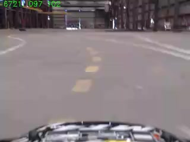

## Video Acquisition 

Video is streamed from the car to the Autonomia Cloud server using the RTMP protocol at 30 frames per second, with a 240x320 resolution and H.264 encoding. The streaming is controlled by the `video_start` and `video_stop` JSON/RPC methods.

To acquire video for CNN training, the `video_start` method must be called with the `{'telem':true}` parameter. With this option, the video generated embeds steering and throttle servo values in the bottom left of each frame. 

>Key to keeping the car additional hardware minimal is to perform all offline image processing and CNN training not on the car computer but on a cloud server or a desktop.

**Example of image with telemetry:**



**Corresponding telemetry record:**
```
{"c":6721,"s":107,"time":"1492552494401","t":102,"device_id":"B827EB0431DA"}
```
Both `time` in Epoch msec and frame count `c` are used for synchronizing video and telemetry. In most cases, following the image extraction procedure indicated below, the image filename contains the frame number, as expected in the model training.

> `steering` and `trhottle` values are in the `[0,180]` range with `90` as neutral. This is the values received by the RC radio receiver and captured by the Arduino controller.

Streaming video is automatically ingested and stored in the Autonomia cluster in `flv` files of 5 minutes length with the filename including the vehicle identifier and an Epoch timestamp in seconds. A video file stored in Vederly cloud has a name that includes a `camera_key` unique for the vehicle, and an Epoch `timestamp`. For instance: `74DA388EAC61-1482024251.flv`

Video and telemetry files are transfered automatically from the Autonomia servers to an S3 bucket.

## Preparation Steps
Once a telemetry video file has been downloaded, the preparation steps are:

1. Extract frames from the video
2. Train the model
3. Deploy the model into the car

### Extract Frames from Video
A video file is split in individual frames using the `ffmpeg` command:
```
ffmpeg -i <INPUT-FILE> -qscale:v 2 img%05d.jpg
```
> the `qscale:v 2` option is to obtain JPEG images with the best possible quality

Each frame is a JPEG image file with a name containing sequential numbers in order of time.

Example:
```
# create a directory to contain the frames using the timestamp in the filename
mkdir images-1482024251
# change directory and run the ffmpeg command
cd images-1482024251
ffmpeg -i ../74DA388EAC61-1482024251.flv -qscale:v 2  img%05d.jpg
```
> At 30 fps acquisition rate, every minute of video results in 1800 JPEG images.

### Train the Model

The CNN model in `Keras` is defined in the `train.py` Python script. The hyperparameters are in `config.py`, with some exceptions that are hard-coded (learning rate, optimization function).

```
train.py <IMAGE-DIR>
```
Example:
```
cd Autonomia/ConvNet
train.py /home/oem/images-1482024251
```
Once the training is completed, the model is saved as JSON model and the weights in the HDF5 binary format, in the files `autonomia_cnn.json` and `autonomia_cnn.h5`.

>The main application loads the model and weights from the name indicated in the `config.json` file.

### Docker image
For training the CNN we have built a Linux Ubunutu Docker image available in Docker Hub. Since there are
several cross-dependencies, it is recommended to run the image in a Docker container for training.

Docker pull command:
```
$ docker pull marcoeg/python-ml
```
To run the container and mount a local directory with the images:
```
$ docker run -it -p 8888:8888 -v [LOCAL_PATH]:/mnt  marcoeg/python-ml:latest
```
For instance:
```
$ docker run -it -p 8888:8888 -v /home/marco/Videos:/mnt  marcoeg/python-ml:latest
```
A Jupiter notebook is also started and accessible with a browser and the token provided after the container starts.

At startup, check for this message on the console:

```
Copy/paste this URL into your browser when you connect for the first time,
 to login with a token:
     http://0.0.0.0:8888/?token=96acae164b1ea0ff1f2b5d79eee04d73e160df135fb5136b
```

To use the pre-configured container, in another terminal, login the container using the ID:
```
$ docker ps
CONTAINER ID        IMAGE                      COMMAND                  CREATED             STATUS              PORTS                       NAMES
6f395a47bb83        marcoeg/python-ml:latest   "jupyter notebook ..."   6 seconds ago       Up 5 seconds        0.0.0.0:8888->8888/tcp      jovial_engelbart

$ docker exec -it 6f395a47bb83 bash
```

In the container shell, the directory from the host filesystem is in /mnt:
```
root@5eca27f4b434:~# ls /mnt
Oakland-Apr20
```

The Autonomia repo (train2softmax branch) is available in /root/Autonomia. Peform a repo update every time the container starts to insure the head of the tree is used:
```
root@5eca27f4b434:~# cd /root/Autonomia/
root@5eca27f4b434:~/Autonomia# git pull
```

To train the model: 
```
root@5eca27f4b434:~/Autonomia# cd ConvNet/
root@5eca27f4b434:~/Autonomia/ConvNet# ./train.py [PATH_TO_VIDEO_DIRECTORY]
```
For instance:
```
root@5eca27f4b434:~/Autonomia/ConvNet# ./train.py /mnt/Oakland-Apr20/
```
When the training is completed, the trained model is in the files `autonomia_cnn.h5` and `autonomia_cnn.josn`.
The file `test_on_trainingset.png` contains a comparison plot between the predicted and actual steering values 
of the model.

There is a working Jupyter notebook for dataset analysis in /Autonomia/Convnet/data_analysis_lola.ipynb
Change the `vid1_dir` variable in the first cell to the path of the video directory:
```
vid1_dir = '/mnt/Oakland-Apr20/'
```

Important: 
There is no backward compatibility of Keras 2.x models with 1.x. It is necessary to insure the same
version of Tensorflow and Keras are used in the training in the container and the predictions in the RPI.

To check versions:
```
$ python
>>> import tensorflow as tf
>>> import keras as K
>>> tf.__version__
'1.0.1'
>>> K.__version__
'2.0.4'
>>>
```
If either Tensorflow or Keras need to be updated:
```
$ pip install tensorflow==1.0.1 --upgrade
$ pip install keras==2.0.4 --upgrade

```
Keep in mind that changes in the container are not persistent.
